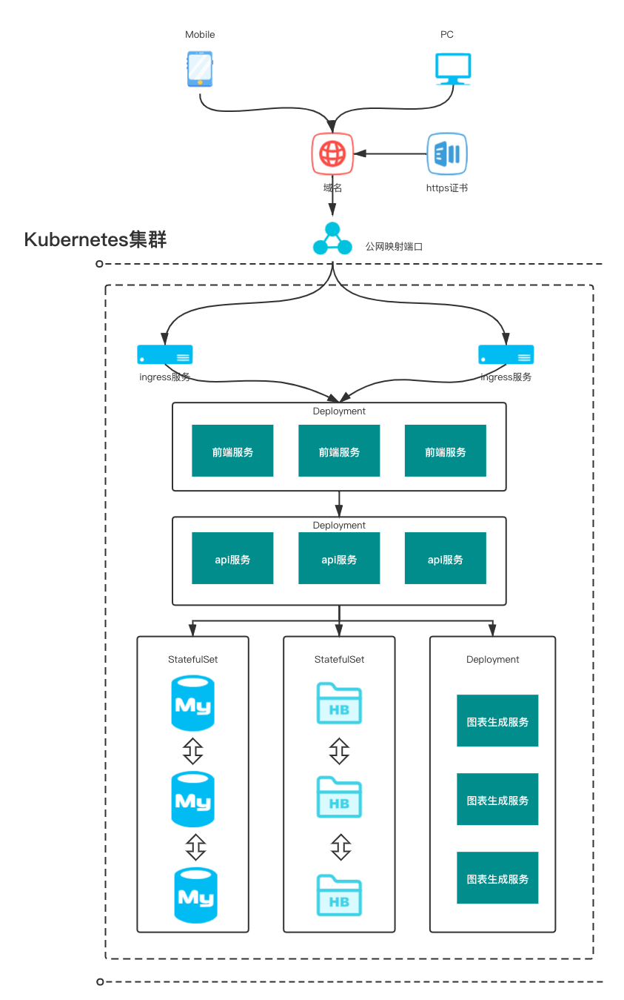
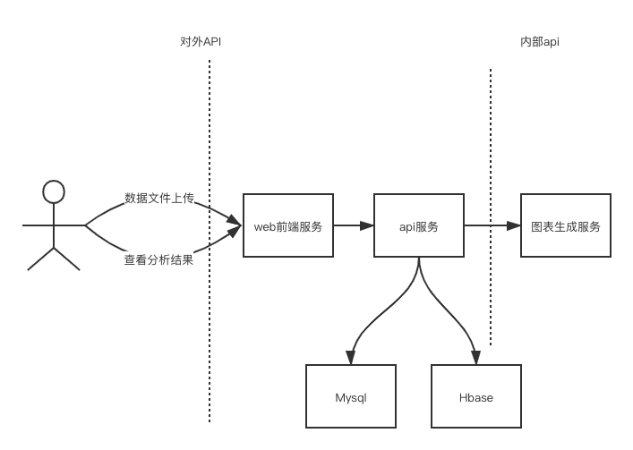
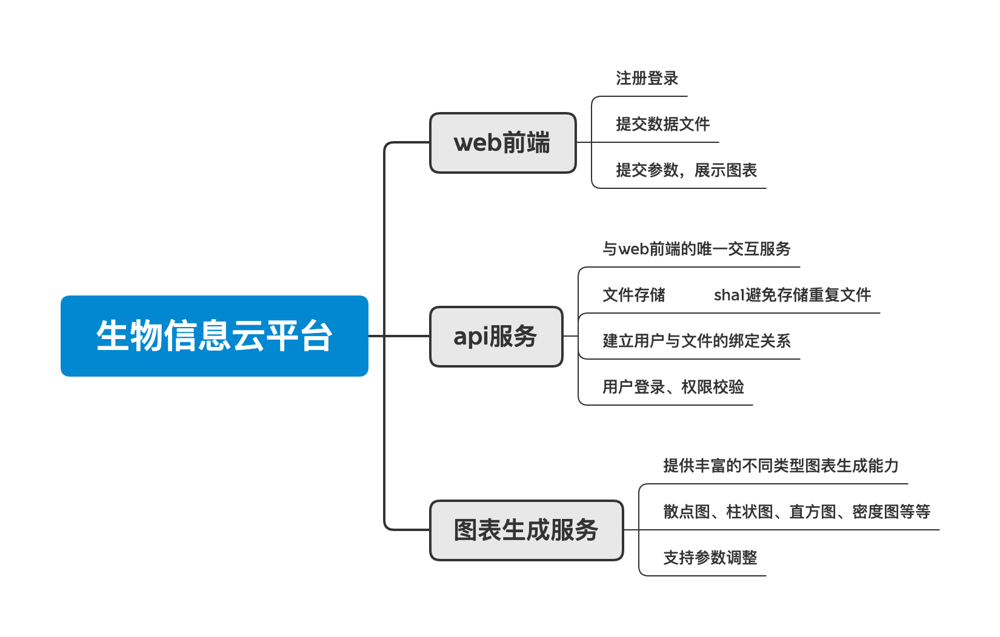

# bio-api
生物信息云画图平台-api服务

访问swagger接口文档：http://localhost:8000/swagger/index.html#/

基于docker运行本项目：

① 首次运行需创建网络：`docker network create outside`

② 执行：`docker-compose up -d`

移除容器及镜像：`docker-compose down --rmi='all'`

